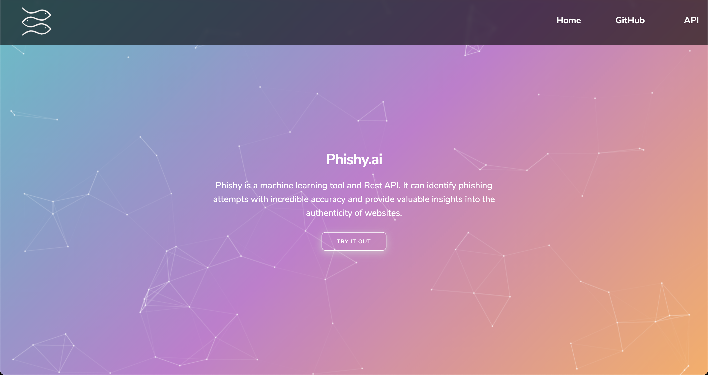
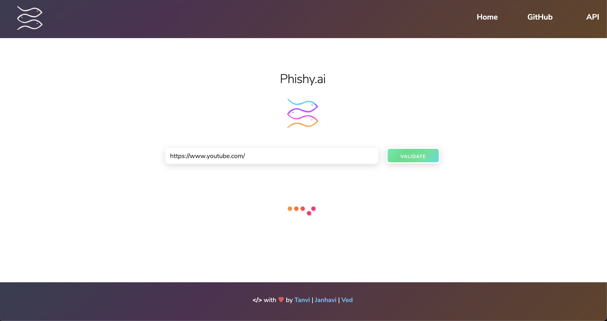
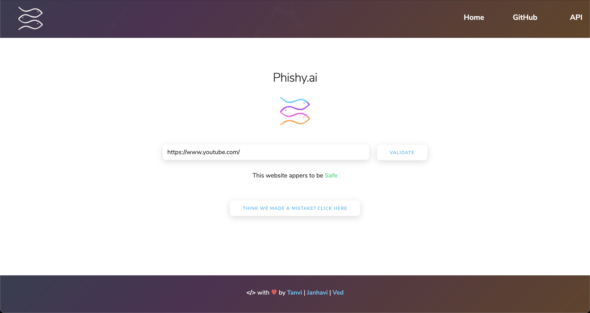

# Phishy

Phishing scams have become a huge problem in today's online landscape. 1 in every 8 employees shares information to a phishing site,
more than 60,000 phishing websites were reported in March 2020 alone and 22% of all data breaches in 2020 involved phishing attacks. This makes dealing with Phishing sites extremely important and the development of robust anti-phishing tools is a great place to start. That's where `Phishy` comes in.

Phishy is a machine learning tool and Rest API. It can identify phishing attempts with incredible accuracy and provide valuable insights into the authenticity of websites.

## Background

While building Phishy, we used a diverse tech stack to develop a comprehensive feature extraction toolkit and implemented an SVM model to classify a given website as `Safe` or `Phishy`. The features we used for our model are based on [research](https://archive.ics.uci.edu/ml/datasets/phishing+websites#) which narrowed down the identifying characteristics of malicious website. You can find the documentation for the features we used [here](https://github.com/tanvig14/Phishy/blob/main/FEATURES.md). 

Our model was trained on data from `UC Irvine's Machine Learning Repository`. You can find more information [here](https://archive.ics.uci.edu/ml/datasets/phishing+websites#). This dataset has over eleven thousand entries, each one contaning thirty features and a final result that tells us whether the website is a Phish or not. 

For our purpose, we narrowed the data down to 14 relevant features before training and validating our model. As it naturally follows, our extraction tools enable the discovery of the same features to facilitate the binary classification.

This implementation gave us promising results. After splitting our data in a 80:20 ratio for training : testing, we were able to achieve the following statistics:
* `Accuracy: 0.9072817729534147`
* `F1 Score: 0.9186830622768742`
* `Precison: 0.9004665629860031`
* `Recall: 0.9376518218623482`

## API

We plan on making Phishy's technology as platform agnostic as possible. That's why we have deployed it as a `Rest API`. You can find more information about the API on our [Website](https://phishy-ai.herokuapp.com/) or by clicking [here](https://github.com/tanvig14/Phishy/blob/main/API.md). We plan on using the same API to develop our Chrome extension and possibly our mobile applications. 

The API also allows us to keep improving our model and ensuring that everyone who uses Phishy can benefit from the enhancements without having to make any changes to their projects. However, we understand that this implementation may not be the right choice for everyone which is why our code is open source and can be used in a manner you see fit for your own projects. 

## Privacy

We believe that your data is yours only. That is why we do not collect or store any personal data or telemetry. Our logs only store the URL's passed with the API calls. Moreover, all our source code is uploaded right here for you to comb through. Our website is not embeded with any trackers or ad's and we intend on keeping it that way.

If you like this approach to software development, please consider supporting us.

## Using Locally

If you want to contribute to Phishy, use our code for your project or just mess around with the code, you can follow the instructions below to get Phishy up and running on your computer.

This guide primarily explains how you can get the API working locally. We expect this would be the most common way to ineract with Phishy's backend. If you want to use Phishy in a different way, you can check out our Project Structure in the [CONTRIBUTING.md](https://github.com/tanvig14/Phishy/blob/main/CONTRIBUTING.md) file.

### 1. Setting up the virtual env and cloning the repository.

Assuming you have pip, git and an appropriate version of python.

Open a virtual enviroment and run:
    
* `pip install -r requirements.txt`

Then, clone the repo with: `git clone https://github.com/tanvig14/Phishy.git` or use the latest stable `release`.

**Note:** We are using `python 3.7.x` for testing.

### 2. Adding the correct web driver for Selenium

Phishy relies on `Selenium` and uses the `Chrome` web driver to extract some of the features. This means that we need to have the appropriate drivers. You can refer to `Selenium's` documentation to make sure you are doing this step correctly. You can also find the Chrome drivers [here](https://sites.google.com/a/chromium.org/chromedriver/downloads). 

Once you have the appropriate driver for your operating system and web browser, you need to place the file in `src/WebSite` with the name `chromedriver`. You may need to make some changes based on the OS and browser you choose to use.

**Note:** All our testing was done on MacOS Big Sur with Chrome 87

### 3. Running Phisy

From the repo on your computer, go to `API` and run:

* `python server.py`

The flask server should start up and you should be able to use the API on localhost.

**Note:** This command works as is on `CMD`, and can work as is in a `Bash` environment if you have your `python3` alias set to `python`.

## Found Bugs?
We would appreciate any support in the form of bug reports in order to provide the best possible experience. Bugs can be reported in the `Issues` tab.

## Contributing
If you like what we're doing and want to contribute to the project, please refer to [CONTRIBUTING.md](https://github.com/tanvig14/Phishy/blob/main/CONTRIBUTING.md). We are happy to accept suggestions in the Issues tab. After we've discussed the changes, we will accept pull requests on a case by case basis.

## Team
This Project was created by:

* [Ved Shah](https://www.linkedin.com/in/ved-shah-852a52181/) [Backend & Machine Learning]
* [Janhavi Shah](https://www.linkedin.com/in/janhavi-shah-615396193/) [UX, Frontend & Graphics]
* [Tanvi Gandhi](https://www.linkedin.com/in/tanvi-gandhi14/) [Backend & Machine Learning]

Please feel free to reach out to any of us if you have any questions about Phishy or if you want to nerd out in general. 
